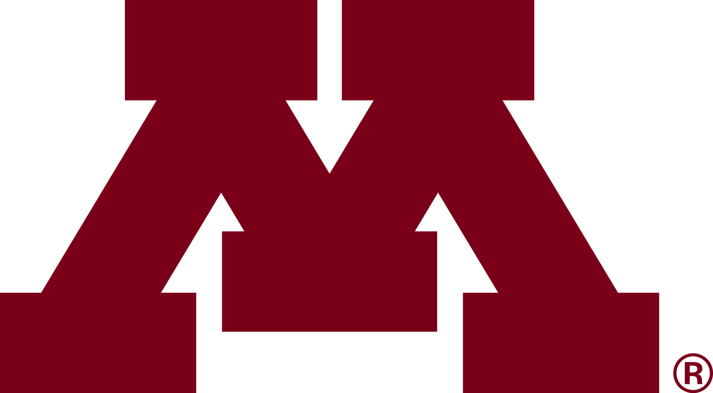
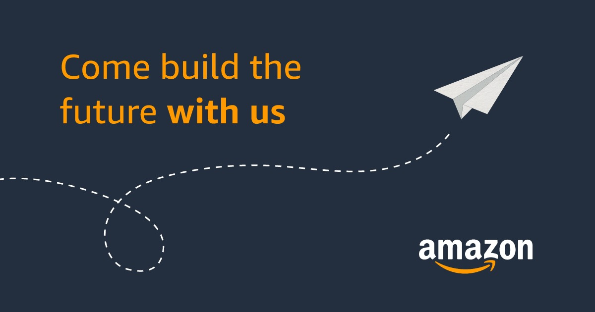
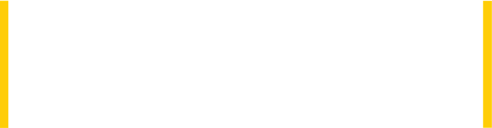

<h1>2025 Midwest Programming Language Summit</h1>

The 2025 Midwest Programming Languages Summit will take place on
<i>Saturday, December 13, 2025</i>, hosted by the [*Department of
Computer Science and Engineering*](https:cs.umn.edu)  at the
[*University of Minnesota, Twin Cities*](https://umn.edu).

The [*Midwest Programming Languages Summit*](https://mwpls.org) is an
informal workshop that is intended to foster the exchange of ideas and
to promote collaboration among faculty and students in the Greater
Midwest area. Anyone interested in programming languages and compilers
— including applications to areas such as systems, software
engineering, and human-computer interaction — is invited to
attend. Our aim is to have a broad selection of talks and posters
about ongoing research and any other topics that may be of interest to
the programming languages community. Student participation is
especially of interest; travel awards facilitated by a grant from the
National Science Foundation are available to encourage such
participation. The summit will have no formal proceedings, but
abstracts and slides will be distributed on the web after the
event.

This year's event is being organized by 
[Favonia](https://favonia.org/), 
[Gopalan Nadathur](https://cs.umn.edu/~ngopalan), and 
[Eric Van Wyk](https://cs.umn.edu/~evw)

# Dates

The important dates to keep in mind and deadlines to adhere to are the
following:

- **Friday, November 14, 2025:** Deadline for
  *[talk and poster proposals](https://forms.gle/wvwAzPzLdRsFEzKR7)*
  and to
  *[apply for travel grants](https://forms.gle/JrroCo1eexijSPJF8)*.
- **Wednesday, November 19, 2025:** Notification deadline for
talk/poster acceptance and grant awards
- **Monday, November 24, 2025:** Deadline to 
  *[register to attend](https://forms.gle/oKL5qQW4SiG2vaAA7)*.
- **Saturday, December 13, 2025:** Meeting date.

<!-- # Program   -->

# Event Details

## Venue

The workshop will be held in [Keller
Hall](https://campusmaps.umn.edu/kenneth-h-keller-hall), the home of
the Computer Science and Engineering Department on the east bank of the
Minneapolis campus of the University of Minnesota.

<iframe src="https://www.google.com/maps/d/u/0/embed?mid=1SD-pEHoj8tcwQb_7fbRYS6no-FEsTHk&ehbc=2E312F"
width="640" height="480"></iframe>

## Accommodation

The nearest hotel, which is only one block from Keller Hall is the [Graduate by Hilton
Hotel](https://www.hilton.com/en/hotels/mspgmgu-graduate-minneapolis/). Other
options that are all within walking distance include the [Days Hotel by
Winham](https://www.wyndhamhotels.com/days-inn/minneapolis-minnesota/days-inn-hotel-university-ave-se/overview?CID=LC:DI:20160927:RIO:Local:SM-diwnct)
on University Avenue, the [Hilton Garden
Inn](https://www.hilton.com/en/hotels/msputgi-hilton-garden-inn-minneapolis-university-area/),
and, just across the Mississippi river, the [Courtyard by
Marriott](https://www.marriott.com/en-us/hotels/mspdc-courtyard-minneapolis-downtown/overview/).

When considering other options, such as through Airbnb, it would be
prudent to check access by [public
transit](https://www.metrotransit.org/home) to the campus. The [Metro
Transit Green Line](https://www.metrotransit.org/route/green), for
example, has a stop right outside Keller Hall and it runs from
downtown Minneapolis (just a few stops away) all the way to downtown St. Paul
(many stops further away).

We will add more information about accommodation, such as about
special rates at hotels if we have been succeed in getting them. Be
sure therefore to check back here later in November. 

## Travel / Public Transit

### By air

One can fly to the [Minneapolis St. Paul International
Airport](https://www.mspairport.com/), code **MSP**.
From the airport, take the 
[Blue Line](https://www.metrotransit.org/route/blue) 
towards Minneapolis to the US Bank Stadium stop. From here, catch the
[Green Line](https://www.metrotransit.org/route/green)
towards St. Paul and get off at the East Bank stop. This is right in
front of Keller Hall where the workshop is taking place.

### By rail

Amtrak has a two connections between Minneapolis and Chicago that
makes for a pleasant journey arriving at the 
[Union Depot](https://www.uniondepot.org/) in St. Paul. The best
option may be the [Borealis](https://www.amtrak.com/borealis-train), a
dedicated line between Chicago and Minneapolis. The [Empire
Builder](https://www.amtrak.com/empire-builder-train), which goes via
St. Paul/Minneapolis from Chicago to Seattle and vice versa, is
another possibility. From the train station / Union Depot, take the
[Green Line](https://www.metrotransit.org/route/green)
towards Minneapolis and get off at the East Bank stop.

## Parking

Parking on the University of Minnesota East Bank campus is,
unfortunately, not the easiest of propositions. The best option for
day parking is to use University of Minnesota parking
ramps. Information on these facilities can be found in the
**University Parking** section of the [Keller
Hall](https://campusmaps.umn.edu/kenneth-h-keller-hall) web page. 

# Sponsors

The event is being supported by the [National Science
Foundation](https://nsf.gov), the [Department of Computer Science at
the University of Minnesota](https://cs.umn.edu), the automated
reasoning group in Minneapolis ([an internship program in automated
reasoning](https://amazon.jobs/en/jobs/3050073/2026-applied-science-internship-automated-reasoning-united-states-phd-student-science-recruiting))
of *Amazon Web Services*, the [Galois](https://galois.com) group in
Minneapolis and [SIFT: Smart Information Flow
  Technologies](https://sift.net). 

<table>
<tr>
<td></td>
<td>
  
</td>
<td>
  
</td>
<td>
  
</td>
</tr>
</table>
  

# TEST 2

<table>
<tr>
<td></td>
<td>
  
</td>
<td>
  
</td>
<td>
  
</td>
</tr>
</table>
  

sift 509 x 62
      1231 x 150
      
aws  1200 x 630
      293 x 150
      
galois 691 x 181
       572 x 150
       
nsf 602 x 602
     150 x  150
     
M  1947 x 1071
    273 x 150
