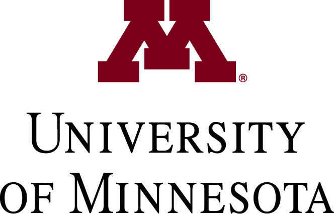

# Midwest PL Summit

Saturday, December 13, 2025

[University of Minnesota](https://umn.edu),
[Department of Computer Science and Engineering](https://cs.umn.edu)

The Midwest PL Summit is an informal workshop to foster the exchange
of ideas and to promote collaboration among faculty and students in
the Greater Midwest area. Anyone interested in programming languages
and compilers — including applications to areas such as systems,
software engineering, and human-computer interaction — is welcome to
attend. Our aim is to have a broad selection of talks and posters
about ongoing research and any other topics that may be of interest to
the PL community. There will be no formal proceedings, but abstracts
and slides will be distributed on the web after the workshop.

Organizers: 
[Favonia](https://favonia.org/)
[Gopalan Nadathur](https://cs.umn.edu/~ngopalan), and 
[Eric Van Wyk](https://cs.umn.edu/~evw)

# Dates
- TBD: Deadline to 
  [Submit Talk and Poster Proposals](https://forms.gle/wvwAzPzLdRsFEzKR7)
  and
  [Apply for Travel Grants](https://forms.gle/JrroCo1eexijSPJF8)

- TBD: Notification of Decisions

- TBD: Deadline to [Register to Attend](https://forms.gle/oKL5qQW4SiG2vaAA7)

- Saturday, December 13: Workshop

<!-- # Program   -->

# Attending

The workshop will be held in Keller Hall on the east bank of the
Minneapolis campus in room 3-180.

<iframe src="https://www.google.com/maps/d/u/0/embed?mid=1SD-pEHoj8tcwQb_7fbRYS6no-FEsTHk&ehbc=2E312F"
width="640" height="480"></iframe>

## Accommodation

## Travel / Public Transit

### By air

One can fly to the [Minneapolis St. Paul International
Airport](https://www.mspairport.com/), code **MSP**.

From the airport, take the Blue Line towards Minneapolis to the US
Bank Stadium stop. From here, catch the Green Line towards St. Paul
and get off at the East Bank stop. This is right in front of Keller
Hall where the workshop is taking place.

### By rail

Amtrak has a two connections between Minneapolis and Chicago that
makes for a pleasant journey arriving at the 
[Union Depot](https://www.uniondepot.org/) in St. Paul.

The best option may be the
[Borealis](https://www.amtrak.com/borealis-train) line between Chicago
and Minneapols. One can also ride the [Empire
Builder](https://www.amtrak.com/empire-builder-train) which goes via
St. Paul/Minneapolis from Chicago to Seattle.

From the train station / Union Depot, take the Green Line towards
Minneapolis and get off at the East Bank stop.

## Parking

# Sponsors

# Sponsors

- National Science Foundation.

  
  
- Department of Computer Science and Engineering, University of
  Minnesota.
  
  

- Amazon Web Services. Click the logo to learn more about their
internship program in automated reasoning.

  

# Sponsors

<table>
<tr>
  <td></td>
  <td></td>
</tr>
<tr>
  <td>National Science Foundation</td>
  <td>University of Minnesota</td>
</tr>
<tr>
  <td>National Science Foundation</td>
  <td>Department of Computer Science and Engineering</td>
</tr>
</table>

# Past instances

 * [2023, University of Michigan](https://mwpls2023.engin.umich.edu/)
 * [2024, University of Chicago](http://pl.cs.uchicago.edu/PLSummit/2024/)

